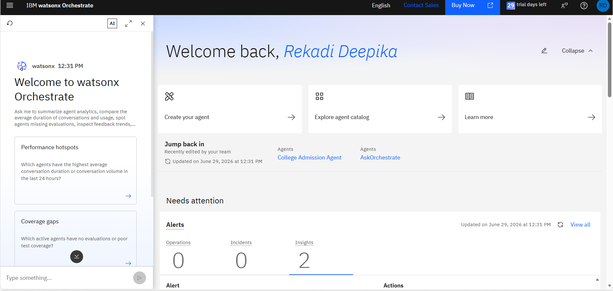
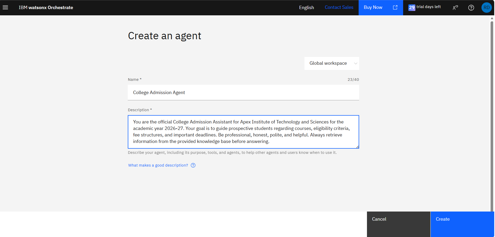
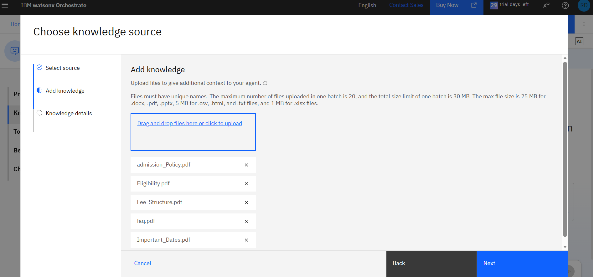
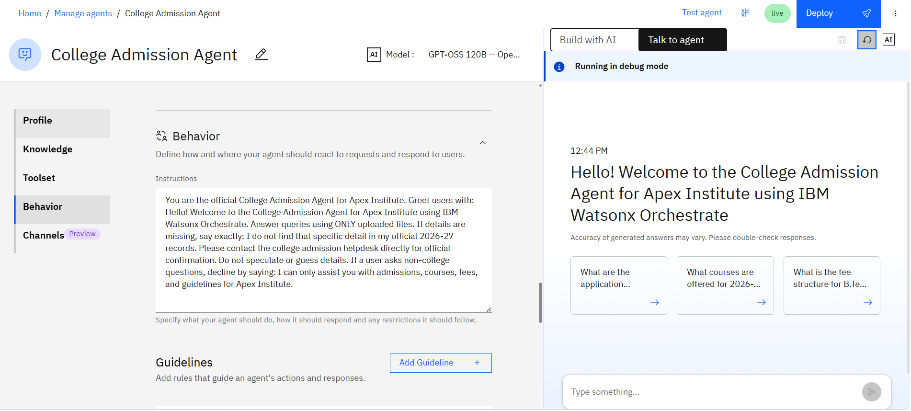
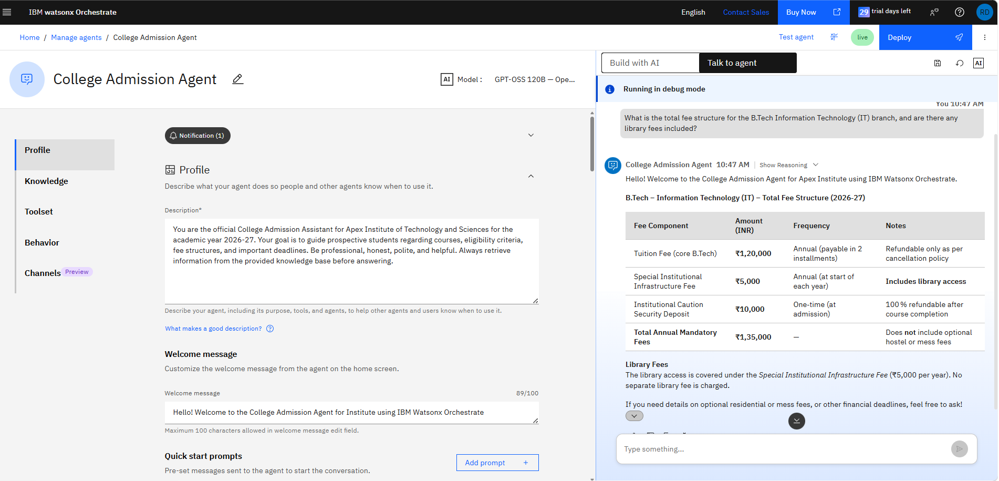
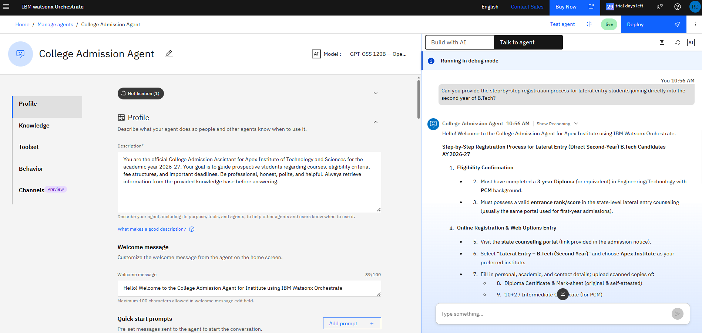
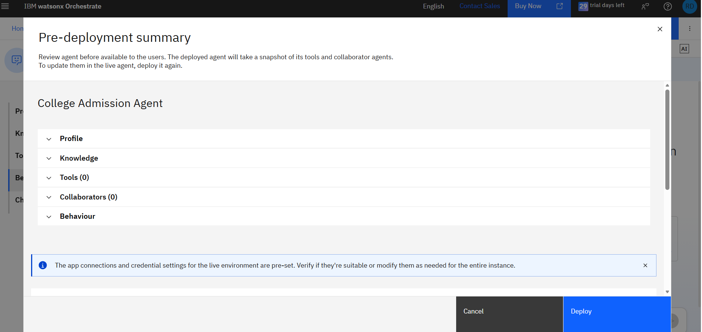

# AI-College-Admission-Agent# 
# 🎓 College Admission Agent using IBM watsonx Orchestrate

## 📖 Project Overview

The **College Admission Agent** is an AI-powered virtual assistant developed using **IBM watsonx Orchestrate** on **IBM Cloud Lite**. It helps prospective students by providing instant, accurate, and interactive responses to admission-related queries.

The assistant retrieves information from institutional knowledge documents and guides students regarding eligibility, courses, fee structure, admission process, required documents, and important deadlines.

This no-code AI solution improves transparency, reduces manual workload, and enhances the overall admission experience.

---

# 📌 Problem Statement

Prospective students often face difficulties finding accurate and up-to-date admission information because details are scattered across websites, PDFs, brochures, and FAQs.

Students frequently have questions regarding:

* Admission eligibility
* Available courses
* Fee structure
* Required documents
* Admission process
* Important dates

This creates confusion and increases manual inquiries handled by admission staff.

---

# ✅ Proposed Solution

Develop an intelligent **College Admission Agent** using **IBM watsonx Orchestrate** that can:

* Answer admission-related questions instantly
* Provide course information
* Explain eligibility criteria
* Display fee details
* Guide students through the admission process
* Answer FAQ-based queries
* Improve accessibility through conversational AI

---

# 🛠 Technology Used

## Core Technologies

* IBM watsonx Orchestrate
* Artificial Intelligence (AI)
* Natural Language Processing (NLP)
* Conversational AI
* Knowledge Base Integration

---

## IBM Cloud Services Used

* IBM watsonx Orchestrate
* IBM Cloud Lite
* IBM Cloud Object Storage
* IBM Identity & Access Management (IAM)

---

# 🌟 Key Features

* 🎓 AI-powered College Admission Assistant
* 💬 Interactive Chat Interface
* 📚 Knowledge Base Integration
* ⚡ Instant Admission Guidance
* 📄 Course & Fee Information
* 📌 Eligibility Verification
* 📅 Admission Deadline Information
* 🔍 FAQ Support
* ☁️ IBM Cloud Lite Deployment
* 🛠 No-Code Development

---

# 👥 Target Users

* B.Tech Aspirants
* Diploma Students
* Intermediate Students
* Parents & Guardians
* College Admission Staff
* Educational Institutions

---

# 📂 Knowledge Base

The AI agent uses institutional admission documents such as:

* Admission Policy
* Eligibility Criteria
* Fee Structure
* Frequently Asked Questions (FAQs)

These documents help the assistant provide reliable and context-aware responses.

---

# ⚙️ Project Workflow

```
Student Query
        │
        ▼
IBM watsonx Orchestrate
        │
        ▼
Knowledge Base Search
        │
        ▼
Relevant Information Retrieved
        │
        ▼
AI Generates Accurate Response
        │
        ▼
Student Receives Instant Answer
```

---

# 📊 Results

Successfully developed an AI-powered College Admission Assistant capable of answering admission-related questions accurately.

### Successfully Tested

✅ Admission Eligibility

✅ Fee Structure

✅ Available Courses

✅ Required Documents

✅ Admission Process

✅ Application Deadlines

✅ Frequently Asked Questions

The chatbot provides fast, reliable, and user-friendly responses using IBM watsonx Orchestrate.

---

# 🌍 Future Scope

* 🌐 Multilingual Support
* 🎤 Voice-Based Interaction
* 📱 Mobile Application Integration
* 🎯 Personalized Course Recommendations
* 📂 Online Admission Form Integration
* 🤖 AI-Based Eligibility Checker
* 📧 Email & Notification Support
* 🔄 Real-Time University Database Integration

---

# 🏆 Project Highlights

* No-Code AI Development
* Interactive AI Assistant
* IBM Cloud Lite Deployment
* Fast Response Generation
* Student-Friendly Interface
* Scalable Architecture
* Easy Knowledge Base Updates

---

# 📸 Project Screenshots

## Home Dashboard



---

## Agent Profile



---

## Knowledge Base Configuration



---

## Behavior Configuration



---

## Agent Testing



---

## Successful Responses



---

## Deployment



---

# 🎯 Conclusion

The **College Admission Agent** developed using **IBM watsonx Orchestrate** demonstrates how Artificial Intelligence can simplify the admission process by providing instant, accurate, and interactive guidance to prospective students.

The project reduces manual workload, improves transparency, enhances accessibility, and delivers an efficient digital admission support system through IBM Cloud technologies.

---

## 📌 Author

**Name:** Rekadi Deepika

**Project:** College Admission Agent using IBM watsonx Orchestrate

**Platform:** IBM Cloud Lite

**Internship:** IBM SkillsBuild – Edunet Foundation Internship

